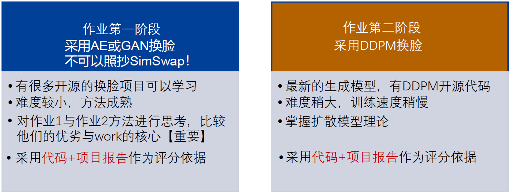
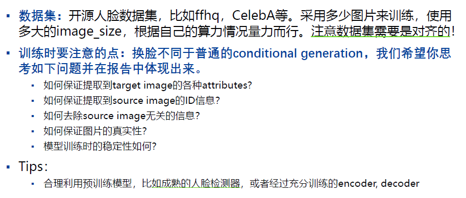
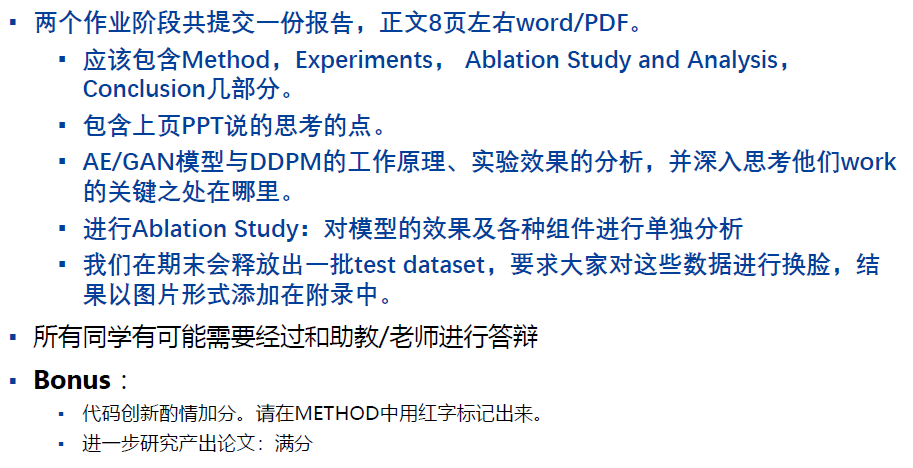

# MLproject
<h2>dataset prepare</h2>
collect celebA<br>
dataset=torchvision.datasets.CelebA(
        root="celeba",split='train',
        transform=transforms.Compose(
            [transforms.Resize(img_size),transforms.CenterCrop(img_size),
             transforms.ToTensor(), transforms.Normalize((0.5,0.5,0.5),(0.5,0.5,0.5))]
        ),download=True
    )<br>
this may not work on your computer,so i recommend you go to"https://drive.google.com/drive/folders/0B7EVK8r0v71pTUZsaXdaSnZBZzg?resourcekey=0-rJlzl934LzC-Xp28GeIBzQ" to get "img_align_celeba.zip" and unzip it in the directory<br>
the attributes and the landmarks have been pushed<br>

<h2>Condition GAN </h2>
待解决的问题：<br>
1.提取celebA库中图片的特征作为label

<h2>Usage</h2>
please use "python train.py --name label2city_512p --resize_or_crop scale_width_and_crop --label_feat" to train the model<br>

【parsed】

- 训练： 
   ```shell
   CUDA_VISIBLE_DEVICES=0 python train.py --name faceIm --label_nc 19 --loadSize 512 --dataroot ./datasets/faceOriginIm/ --label_feat
   ```
   
- 测试：
   ```shell
   # 先生成目标图片feature，实验名需要同名
   python encode_features.py --name faceIm_feat --dataroot ./datasets/faceOriginT/ --label_nc 19 --loadSize 512 --label_feat --load_pretrain ./checkpoints/faceOriginIm/
   
   # pretrain模型要放在同名的/chechpoints/下面，会自动检索
   cp ./checkpoints/faceOriginIm/latest_net_*.pth ./checkpoints/faceIm_feat/
   
   python test.py --name faceIm_feat --label_nc 19 --loadSize 512 --dataroot ./datasets/faceOriginT/ --label_feat --use_encoded_image
   ```
   
- 效果：

   

---

## 语义分割使用方法

https://notes.sjtu.edu.cn/s/sCxuC8AAt

## 相关仓库
也许可以参考：
- 人脸数据集升级：
  - https://github.com/switchablenorms/CelebAMask-HQ
  - 语义分割下对于原图的编辑，在最后的关联仓库中有专做人脸语义分割的部分：https://github.com/zllrunning/face-parsing.PyTorch
  - derived dataset相关介绍：https://zhuanlan.zhihu.com/p/52188519
- 


## 第一次会议log

> 3-12 ?

### preview



#### 第一阶段：传统换脸

##### 模型

1. AE: 隐空间分布不可控
2. VAE: 先验隐空间分布特点
   - Encoder, Decoder
3. **Conditional VAE**
4. GAN
     - Generator, Discriminator
     - 训练上的困难: Wasserstein GAN, cycle GAN
5.  **CGAN**

##### 参考

- SimSwap: https://github.com/neuralchen/SimSwap
- Pytorch官方GAN库：https://github.com/eriklindernoren/PyTorch-GAN/blob/master/implementations/acgan/acgan.py
- Pytorch官方VAE库：https://github.com/AntixK/PyTorch-VAE

#### 第二阶段：SOTA换脸

##### 模型

- **DDPM**: 马尔可夫链， 往回加高斯噪声；然后再依次推回去
- Conditional DDPM

##### 参考

- ILVP folk: https://github.com/colorful-liyu/diffusion
  - 有注释解读，不懂的可以issue
- DDPM
  - https://github.com/hojonathanho/diffusion
  - arxiv.org/abs/2006.11239
- ILVR
  - https://github.com/jychoi118/ilvr_adm
  - arxiv.org/abs/2108.02938

#### 作业要求





### 计划安排

- 12周left，前面时间多做点
  - 最后两周复习。
  - 12-13周时左右完成代码部分。后续写报告。
  - 前面共9周时间，着重在作业二。
- 每周固定周五3-4节讨论，这周进展、周末及下周安排
- Conditional系选择，三个大模块
  - 每个模块大概2-3周
  - VAE2周，GAN2-3周，……
  - 一个礼拜搞完理论，部分问题的回答。文书任务与实验独立可并行。项目报告的实验需要补
- 代码保持同一份。训练之前那些部分改了需要高亮，因为训练成本很大


- DDPM代码熟悉
- 服务器环境
  - tensorflow1 install 20系列
- 团队代码、文件数据共享
- 时间周期安排（留出期末test dataset时间，提前api）
- 作业一善用其他成熟开源库，尝试跑跑？看看都用的哪些模块、如何架构
- 要以什么baseline来搭，不同的ablation实验设置
- 读论文读点子，数学推导等
- 创新点：一个地方整点创新够了
- 数据集：Large-scale CelebFaces Attributes (CelebA) Dataset
- 关于进度：前面几周可以搭快点，后面实验一边跑一边移到下一阶段的搭建性工作中。给每个模型训练留出时间

### 下一阶段

> VAE模型的选择与搭建，理论部分的回答

**理论部分：**

- VAE&GAN论文阅读
- 理论部分问题回答（预计70-80%）；部分文书工作

**工程部分：**

- VAE论文大致浏览
- VAE开源库熟悉了解，各库之间对比分析
  - 敲定合适模型（VAE？CVAE？）
- 挑个开源库搭搭，跑通代码

**暂留问题：**

- VAE用何种模型？
- 是否在此阶段设置创新点？

## 第二次会议log
> 3-18

- 数据集输入接口（custumize）；用CelabA
- Arcnet，insightface的人脸特征提取
- 将当前的GAN框架换成VAE
  - 隐空间的特征融合一样
  - loss部分，A与fake的特征Loss + B与fake的背景Loss 一样


- 当前的整个simswap共享到github
- 冗余信息（video，demo, docs, ...）删除
- 作业一的工程，需要改到什么程度？“不可抄作业”的定义
